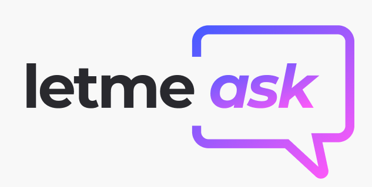

<p align="center">
   
</p>

<p align="center">
  
  
  
  
<p align="center">
  <a href="#sobre">Sobre</a>&nbsp;&nbsp;&nbsp;|&nbsp;&nbsp;&nbsp;
  <a href="#tecnologias-utilizadas">Tecnologias utilizadas</a>&nbsp;&nbsp;&nbsp;|&nbsp;&nbsp;&nbsp;
  <a href="#como-rodar">Como rodar?</a>&nbsp;&nbsp;&nbsp;|&nbsp;&nbsp;&nbsp;
  <a href="#licença-e-autora">Licença e Autora</a>
</p>

## Sobre
**Letmeask** -> trata-se de um projeto realizado durante um evento da Rocketseat - Next Level Week (Edição #6) / Trilha React.JS

### Templates Figma
- [Figma Template](https://www.figma.com/file/8lQc4MqRMiHLHupNo3YZRA/Letmeask-(Copy)?node-id=45%3A3279)

### Tecnologias utilizadas 
- [React.JS](https://reactjs.org/)
- [TypeScript](https://www.typescriptlang.org/)
- [Firebase](https://firebase.google.com/?hl=pt)

## Como rodar?

Execute os comandos no seu terminal:

```bash
# Clone o repositório
$ git clone https://github.com/yurimarim/nlw-letmeask-reactjs.git

# Entre no repositório
$ cd letmeask

# Instale as dependências
$ yarn install

# Execute a aplicação
$ yarn start
```

## Licença e Autora

Este projeto está sob a licença MIT. Veja o arquivo [LICENSE](https://github.com/yurimarim/nlw-letmeask-reactjs/blob/main/LICENSE.txt) para mais detalhes.

<p>
  


[](https://www.linkedin.com/in/yuri-marim-6b6130197/)
